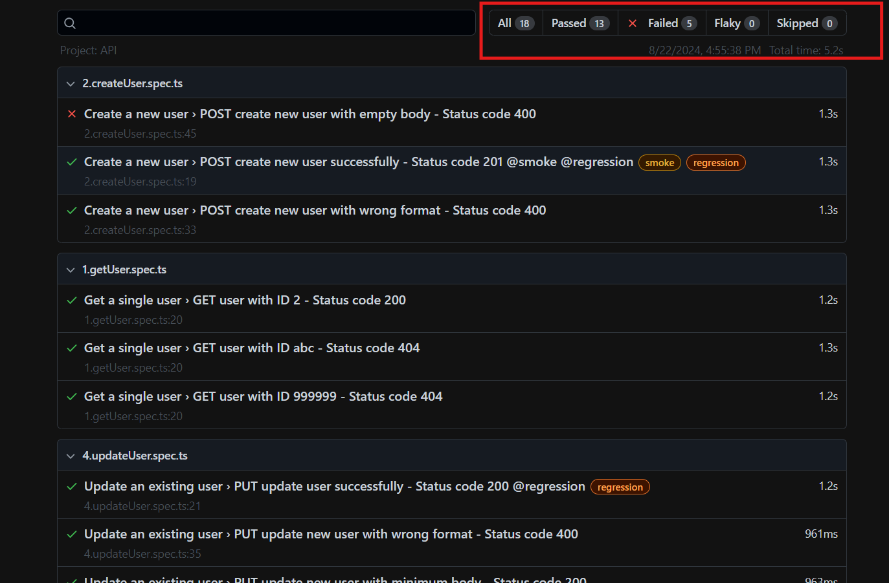

Reqres.in Project
================

Overview
--------

This project is a test automation framework for the Reqres.in API. It uses Playwright as the test runner and TypeScript as the programming language.

Getting Started
---------------

### Prerequisites

* Node.js (version 20.13.0 or higher)
* npm (version 10.5.2 or higher)
* Playwright (version 1.46.1 or higher)

### Installation

1. Navigate to the project directory: `cd reqres.in`
2. Install the dependencies: `npm install`

### Running Tests

1. Run the tests using the command: `npx playwright test`
2. You can also run specific tests using the command: `npx playwright test <test-file>`
3. To run only @smoke test, run `npx playwright test --grep @smoke`
4. To run @smoke and @regression, run `npx playwright test --grep "@smoke|@regression"`

### Environment Configuration

1. Update baseURL in `/config/config.ts`
2. Update NODE_ENV in `.env` file. Currently it's point to development environment.

Test Report
-----------------------
After execution, html report can be found in `playwright-report/index.html`

Test Structure
--------------

The tests are organized into the following folders:

* `tests/e2e`: End-to-end tests for the Reqres.in API
* `tests/user.spec.ts`: Tests for the user endpoints
* `tests/login.spec.ts`: Tests for the login endpoints

Test Data
---------

The test data is stored in the `test-data` folder. It includes JSON files for user data, login requests, and other test data.

API Endpoints
-------------

The project tests the following API endpoints:

* `POST /login`: Login with user credentials and get auth token
* `GET /users/:id`: Retrieves a single user by ID
* `POST /users`: Creates a new user
* `PUT /users/:id`: Updates an existing user
* `DELETE /users/:id`: Deletes a user

Playwright Configuration
-----------------------

The Playwright configuration is stored in the `playwright.config.ts` file. It defines the test runner settings, including the browser and device configurations.

Troubleshooting
---------------

* If you encounter any issues running the tests, check the console output for error messages. Or use this command `npx playwright test --ui` to open Playwright ui execution mode, network log can be traced there.
* Make sure you have the latest version of Playwright installed.
* If you're still having issues, try running the tests in debug mode by turn on the debug mode in .env file: `DEBUG=true`

### Test Result Screenshot
